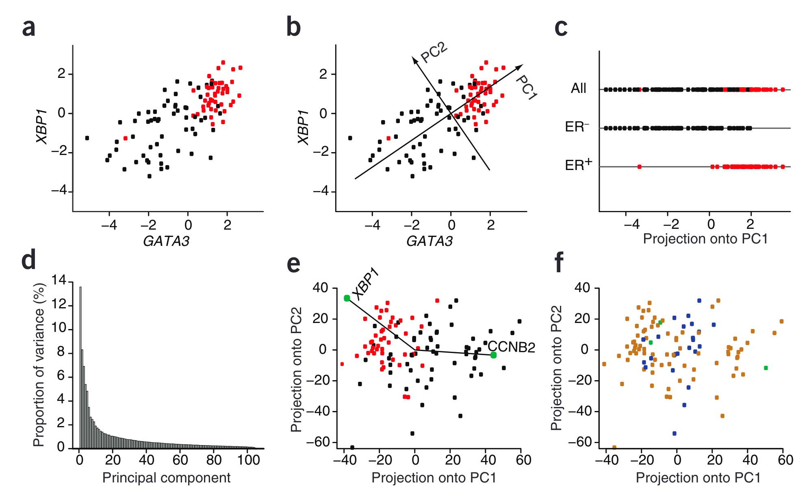

# PCA on gene expression data

A simple intuition between two different labels is the color use to paint them.
Human diseases are complex, and over the time we have learned that there is
**NO panacea**. Often, treatments are planned based on the biomarkers. Again,
we learn this over time by our mistakes or careful studies. One such example is
Breast Cancer, which are categorized based on expresion of certain receptors.
But, how we learn them is a great computational problem. See this [Nature
Primer](https://www.nature.com/articles/nbt0308-303) to know more.

In this project, we will peform PCA on Gene Expression Data from the above
primer. The Gene Expression Omnibus (GEO) ID is
[GSE5325](https://www.ncbi.nlm.nih.gov/geo/query/acc.cgi?acc=GSE5325).

You will ALMOST (the data point values may differ a bit, but the patterns will be similar) be reproducing Figure 1 of the paper. The data for all 105 patient samples are organized in three files.

- `data/class.tsv`: has the labels. 1 (ER+ breast cancer), 0 (ER- breast cancer).

- `data/filtered.tsv.gz`: complete dataset. Header is the ID for genes.

- `data/columns.tsv.gz`: ID to gene name mapping.

For example, 4404 is the ID for gene XBP1 (Figure 1a - Y-axis).

Your goal is to:

1. Extract XBP1 and GATA3 expression levels in all 105 patients, and generate the scatter plot as seen in 1a (coloring should be done by the class). Remember that pattern in your plot should be similar to the paper.

2. Run PCA on the matrix and project these 2-D points on PC1. Generate Fgure 1c.

See the plot below.

